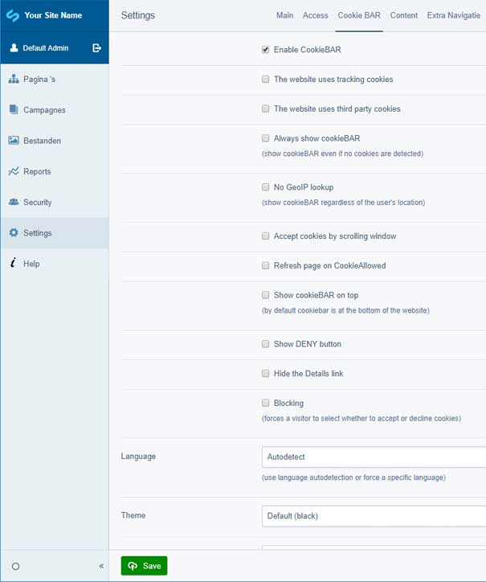

# SilverStripe plugin for CookieBAR #

This module adds CookieBAR to your SilverStripe website. CookieBAR is a cookie notice solution for the EU cookie law. It detects automatic if there are cookies using on the website and if the visitor is in an EU country, if yes it adds the cookie notice bar. It also detects the language of the visitor and shows the right text for country and language.

For more information see:
* https://cookie-bar.eu
* https://github.com/ToX82/cookie-bar.

### What this module does ###

It adds the CookieBar javascript to your website using CDN and it adds a CookieBAR section to the config in the CMS. Here you can enable/disable the CookieBAR and customize the behaviour and appearance if you want.

For example: if you want to show the text of CookieBAR always in a specific language or show the bar also in countries outside the EU, you can set this in the config section.

### Requirements ###

SilverStripe 4

### Version ###

Using Semantic Versioning.

### Installation ###

Install via Composer:

composer require "hestec/silverstripe-cookiebar": "1.*"

### Usage ###

After installation go to the CookieBAR tab in the CMS settings and check enable.

### Todo/Issues ###

No known issues. For ideas or issues contact us.